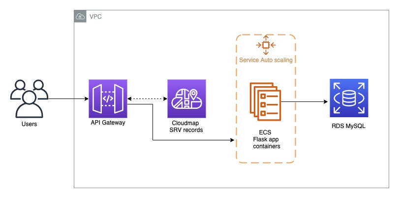

# Identity-service
User Management and authentication service

Architecture Diagram


1. Users connect to AWS api gateway endpoint
2. Api gateway connects the traffic to respective ecs service
3. Cloudmap for resource discovery 
4. ECS to run flask application containers 
5. RDS for persistent storage

TABLE schema
```commandline
Create table `users` ( `username` varchar(20) primary key, email varchar(20), password varchar(20), lastlogin timestamp) 
```
